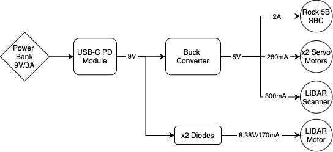

# DeltaBot PCB Overview

The DeltaBot PCB was designed in **KiCad** with a double-sided layer layout. The design integrates key subsystems including the **Radxa ROCK 5B**, LiDAR sensor, camera module, and servo motors.

  

---

## Power System
- Powered via **USB-C Power Delivery (PD)** module at **9V**, stepped down to **5V** using a **DC-DC buck converter**
- A **3.15A fuse** protects against overcurrent
- An **SPDT switch** provides manual ON/OFF control
- A **2200 µF capacitor** suppresses 5V rail ripple for improved voltage stability
- **1 uF** blocking capacitors between each POWER & GND

The following summarizes the power distribution architecture:

  

---

## PCB Layout
- **Front layer**:   
- **Back layer**:   
- 

  
  

---

## ROCK 5B GPIO Pin Assignments

| Function      | GPIO Pin(s) | Description                      |
|---------------|-------------|----------------------------------|
| +5V Power     | 2, 4        | Supplies power to board          |
| GND           | Multiple    | Ground reference                 |
| LIDAR_TX      | 8           | UART TX to LiDAR                 |
| LIDAR_RX      | 10          | UART RX from LiDAR               |
| MOTO_CTRL     | 18          | PWM for LiDAR motor              |
| PWM_L         | 32          | PWM control for left servo       |
| PWM_R         | 33          | PWM control for right servo      |

To change or add to the layout, check [here](https://wiki.radxa.com/Rock5/hardware/5b/gpio) for the rock's gpio connections.

---

## Connectors

- **J2 (LiDAR)**: 7-pin Molex  
  - UART (TX/RX), PWM for motor control, 5V & 8.34V power lines
- **J3 / J4 (Servo Motors)**: 3-pin headers  
  - 5V, GND, PWM (Left/Right)

---

## Files

- [Full Schematic](schematic_files/DeltaBot.kicad_sch)
- [PCB Design](schematic_files/DeltaBot.kicad_pcb)
- [PCB Footprints](schematic_files/deltabot.pretty.zip)
- [Rock 5B KiCAD Symbol](schematic_files/deltabot.lib.kicad_sym)
  
---

