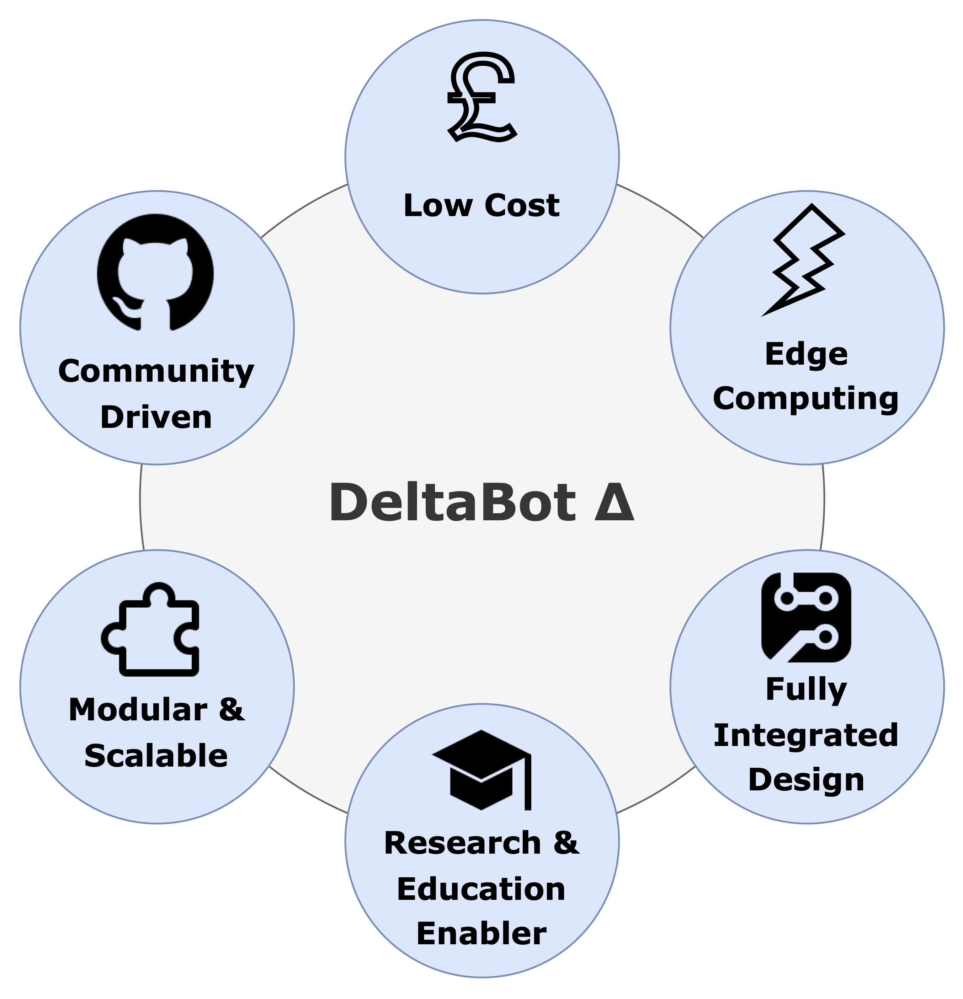

# The Delta Bot

### What is the Delta Bot?
The Delta Bot is an open-source DIY robot AI platform that uses Radxa's single board computer, the [Rock 5B](https://radxa.com/products/rock5/5b/), a simple [camera module](https://www.raspberrypi.com/products/camera-module-v2/), Parallax's [Continuous Rotation Servo Motors](https://www.parallax.com/product/parallax-continuous-rotation-servo-factory-centered/), and the [RPLIDAR A1](https://www.slamtec.com/en/lidar/a1), a LIDAR camera by Slamtec.

<p align="center">
  
</p>


### Purpose & Vision

<p align="center">
  
</p>

### What can it do?

- 360 Degree 2D LiDAR Scans
- Precise Servo Movement 
- 1080p Video Capture
- Can be configured for Line Following, SLAM, Obstacle Detection, and more!

### Video Demonstration

*A video demonstration will be added once mechanical repairs are complete.*

<p align="center">
  <a href="https://www.youtube.com/watch?v=VIDEO_ID">
    
  </a>
</p>

## How to get started
- For the list of components used refer to [List.md](List.md).
- To first set up your RADXA ROCK5B computer, and configure its GPIO pins refer to [Setup.md](Setup.md).
- For details on the DeltaBot schematic, pcb, and footprint library refer to [PCB.md](PCB.md).

### Installing core tools
```bash
sudo apt install libopencv-dev opencv-data python3-opencv
sudo apt install opencl-headers ocl-icd-opencl-dev
sudo apt install libgstreamer1.0-dev gstreamer1.0-plugins-base gstreamer1.0-plugins-good gstreamer1.0-tools
```
### Build the project
```bash
mkdir build
cd build
cmake ..
make
```

### Run the tests
If you want to test the wheels
```bash
./TestServoMotor <left_speed> <right_speed>
```
- `<left_speed>`: Speed value for the left servo motor(-10~10)
- `<right_speed>`: Speed value for the right servo motor(-10~10)
- `speed range`: -10 is full speed counterclockwise, 10 is full speed clockwise, 0 is no rotation
or
```bash
./TestSpeedChange
```
This test will demonstrate the motors accelerating, decelerating, and stopping automatically.

If you want to test the robot's movement
```bash
./TestBotMotion
```
This test allows you to control a robot using your keyboard in a terminal environment. You can drive the robot forward, backward, turn, adjust speed, stop, and exit the program using designated keys.
#### Controls
| Key | Action         |
|-----|---------------|
| W   | Forward       |
| S   | Backward      |
| A   | Turn Left     |
| D   | Turn Right    |
| R   | Speed Up      |
| F   | Decelerate    |
| X   | Stop          |
| Z   | Quit          |

#### Example

```text
Use the keyboard to control the bot: W(forward) S(backward) A(turn left) D(turn right) R(speed up) F(decelerate) X(stop) Z(quit)
Forward.....The speed is: 3
Turn left.....The speed is: 3
Speed up.....The speed is: 4
Stop.....
Quit.....
```
### Run the executable
```bash
./TestLineFollowing
```
You need to place the robot in a well-lit area with a high-contrast black line (e.g., electrical tape) on a white or light-colored background. The robot will then start its autonomous line-following behavior.

## Structure
The following outlines the DeltaBot's Architecture:
<p align="center">
  
</p>

### Additional Mechanical Parts
Additional Mechanical Parts were designed in CAD and can be accessed [here](additional_files/deltabot.f3z).
These were used to secure the external components onto the Single PCB Chassis:
<p align="center">
  
  
  
  
</p>

## Further Documentation
- [RADXA ROCK 5B Geekbenchv6 CPU Results](https://browser.geekbench.com/v6/cpu/11503510)
- [RADXA ROCK 5B Geekbenchv6 GPU (OpenCL) Results](https://browser.geekbench.com/v6/compute/4045302)
- Scripts from rplidar_rock file were adopteed from [here.](https://github.com/berndporr/rplidar_rpi)

## Credits
- Saleh AlMulla - 2721704A@student.gla.ac.uk
- Bernd Porr -  bernd.porr@glasgow.ac.uk
- Yixuan Zha - 2974642Z@student.gla.ac.uk
