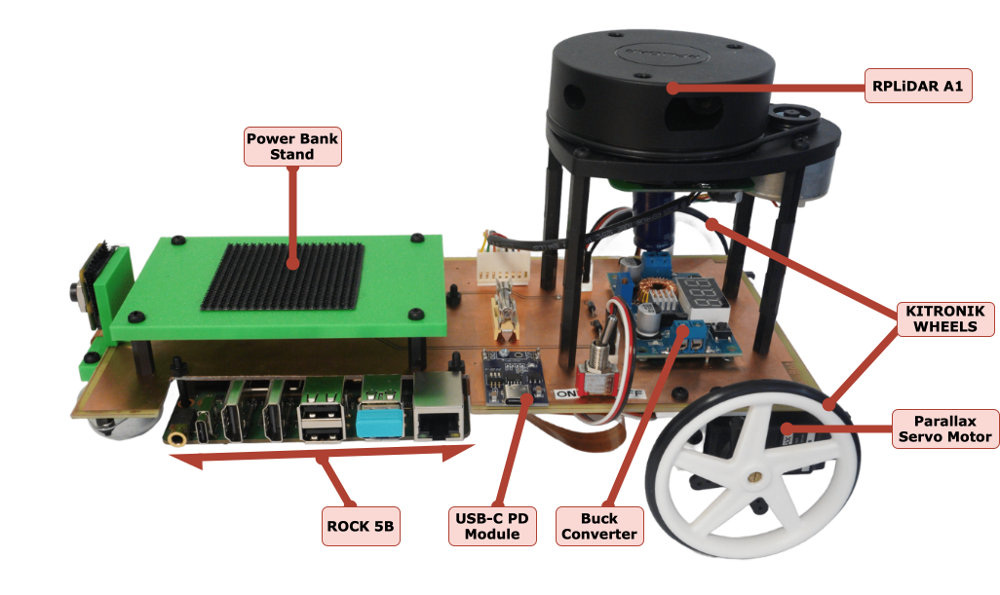
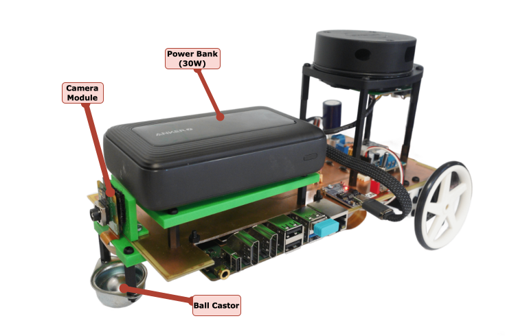
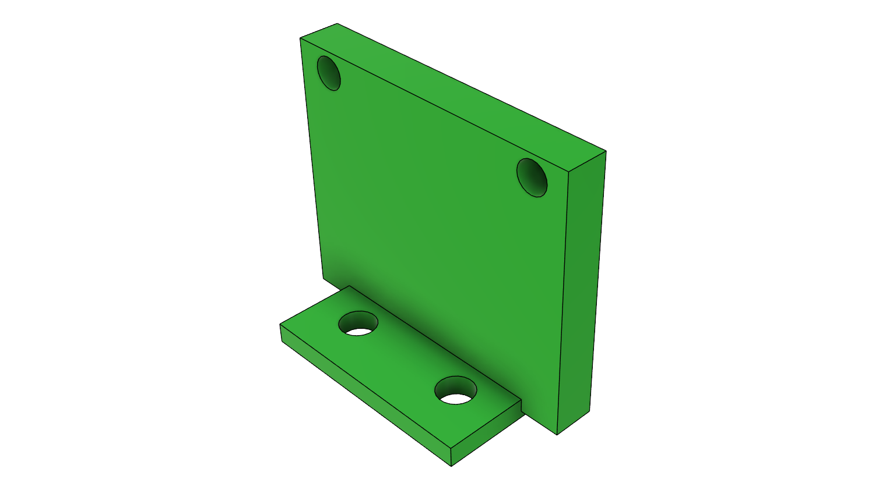

# The Delta Bot

### What is the Delta Bot?
The Delta Bot is an open-source DIY robot AI platform that uses Radxa's single board computer, the [Rock 5B](https://radxa.com/products/rock5/5b/), a simple [camera module](https://www.raspberrypi.com/products/camera-module-v2/), Parallax's [Continuous Rotation Servo Motors](https://www.parallax.com/product/parallax-continuous-rotation-servo-factory-centered/), and the [RPLIDAR A1](https://www.slamtec.com/en/lidar/a1), a LIDAR camera by Slamtec.

  
  

### Purpose & Vision

  

### What can it do?

- 360 Degree 2D LiDAR Scans
- Precise Servo Movement 
- 1080p Video Capture
- Can be configured for Line Following, SLAM, Obstacle Detection, and more!

## How to get started
- For the list of components used refer to [List.md](List.md).
- To first set up your RADXA ROCK5B computer, and configure its GPIO pins refer to [Setup.md](Setup.md).
- For the Delta Bot schematic, pcb, and footprint library refer to [schematic_files](schematic_files).

## Structure
The following outlines the DeltaBot's Architecture:

  

### Power Supply & Connectors

### Additional Mechanical Parts
Additional Mechanical Parts were designed in CAD and can be accessed [here](additional_files/rock 5B v1.f3z).
These were used to secure the external components onto the Single PCB Chassis:

  
  
  
  

## Further Documentation

## Credits
- Saleh AlMulla - 2721704A@student.gla.ac.uk
- Bernd Porr -  bernd.porr@glasgow.ac.uk
